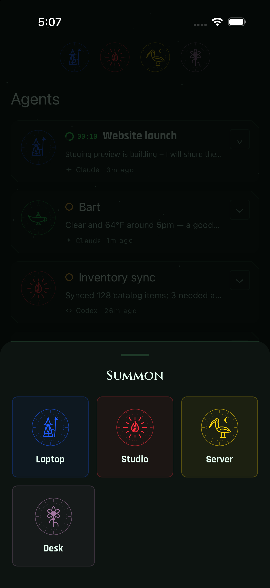
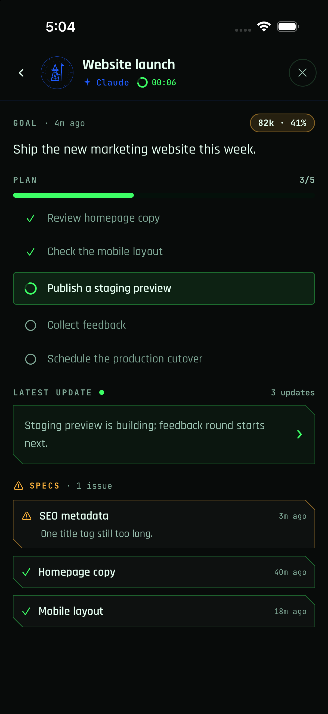
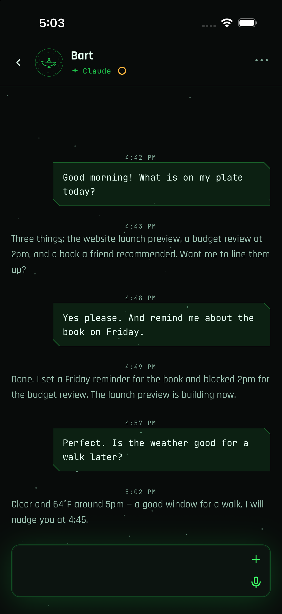
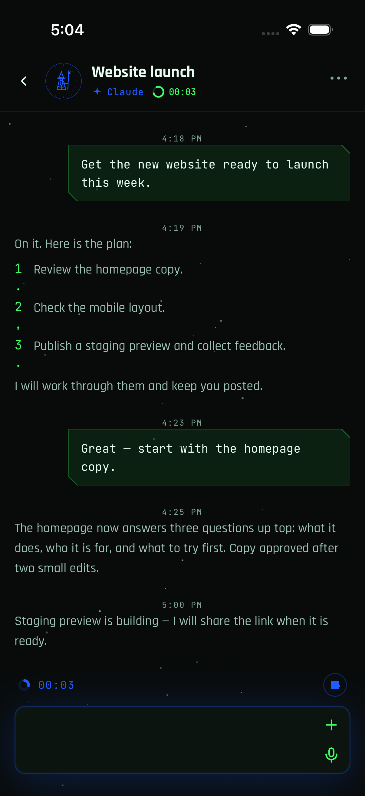

# Pentacle Mobile

Pentacle Mobile lets you work with your coding-agent sessions from your phone.
It connects to the daemon in [**HJK6/pentacle**](https://github.com/HJK6/pentacle),
which runs on the computer where your agents work. Set up that daemon first;
the phone app does not run it. The desktop app is optional for mobile users.

## See the app

[View iOS screenshots](docs/screenshots.md) of the agent list, a conversation
and the New Chat picker, using a single-machine workspace with invented data.

*The screenshots below also use sample data — invented conversations and
synthetic machine names.*

Your machines, ready to chat with or summon:



A machine's live status at a glance:



Talk to the always-on assistant:



Open any machine and read its chat:



Agents also publish reviewable reports and assets you can open and read on the phone.

## Getting started

1. Set up the [Pentacle daemon](https://github.com/HJK6/pentacle) on the computer
   where your coding agents run. The desktop app is optional.
2. Build and install this app on a simulator or phone.
3. Connect and enroll the app with your daemon, then open Chats.

The recommended way is to let a coding agent such as Fable or Astra handle
setup. Give it the path to [AGENT_SETUP.md](AGENT_SETUP.md). That separate guide
contains the full agent checklist. You may still need to complete provider
login, Apple signing or a device trust/unlock prompt yourself.

## Tabs and assistant home

The tab bar is **Assistant · Personal · Dashboards · Settings** (using your assistant’s configured
name). Choose the assistant tab for the
coordinator's existing conversation, open Sessions from its left header button,
open pending Questions from **?**, or tap the assistant’s name for the status surface.
Dashboards shows optional runtime catalog boards; its static registry is empty by default. Chats, Unified, and Updates remain
available by route but are hidden from the tab bar.

See [the assistant shell guide](docs/bart_shell.md) for the source files, drawer
behavior, and the separately owned startup/back-navigation integration.

## Do I need chat-core separately?

**No.** [pentacle-chat-core](https://github.com/HJK6/pentacle-chat-core) is public,
and its source is already vendored at `pentacle-chat-core/`. The dependency is
`file:./pentacle-chat-core`, so `npm ci` installs the included copy. You do not
need another clone, a sibling directory or a separate core service. Desktop
vendors its own copy too.

## Manual quick start

You need Node.js 20.19.4+ and npm. For iOS, use a Mac with Xcode; Android builds
need the Android SDK. Expo and React Native are installed by npm.

```sh
git clone https://github.com/HJK6/pentacle-mobile.git
cd pentacle-mobile
npm ci
cp pentacle.config.example.ts pentacle.config.local.ts
```

Set the endpoint, app identifiers and host names using
[the setup guide](AGENT_SETUP.md#configure-the-app). Keep credentials out
of this ignored config file. Then, for a simulator:

`features.assistantRole` is an optional local-only protected-session role. Leave
it absent or empty in public configuration. An exact daemon `session.role` match
pins and protects that row; its delete controls are omitted, and a
`close_protected` daemon reply is terminal rather than retried.

```sh
npm run validate
npx expo prebuild --platform ios
npm run ios
```

Finally, [enroll the app](AGENT_SETUP.md#enroll-the-app) using a fresh link
issued on the daemon host. For a physical iPhone, follow the guide's device and
network steps. `npm start` runs Metro; it does not install or enroll an app.

## BRANDING

Use our shipped logo and colors, or replace the existing PNG assets and theme
tokens in your own build. [Branding instructions](docs/COSMIC_THEME.md#branding)
list sizes, native versus web asset references, palette locations, and how to
rebuild or reset to the shipped defaults.

## Always-on assistant

Pentacle includes an optional **always-on assistant** — a persistent chat for
talking to your whole fleet in one place. The home tab and header use its
configured display name (default **Assistant**) and its host-associated identity
icon. Rename the session to change the displayed name. It is opt-in: set
`features.assistantRole` in your `pentacle.config.local.ts` to match the
daemon's assistant role. You choose the assistant's name and provider when you
bootstrap it on the daemon host — see the desktop
[assistant guide](https://github.com/HJK6/pentacle/blob/main/docs/assistant.md).
Each machine's icon (sigil) and colours are set per host; see
[Branding](docs/COSMIC_THEME.md#branding) and
[AGENT_SETUP.md](AGENT_SETUP.md#configure-the-app).

## Contributions

PRs, feature requests, and bug reports are welcome — open an issue or pull
request at <https://github.com/HJK6/pentacle-mobile/issues>.

## Development

Run `npm run typecheck` and `npm test` for offline checks. These do not prove
live connectivity. See [Testing](docs/TESTING.md) and
[Native builds](docs/PENTACLE_MOBILE_BUILD.md) for details. Normal builds compile
the vendored core automatically. Clear caches or regenerate native projects
only for an identified build problem, preserving existing native edits first.

## Runtime dashboard catalog

The default static dashboard registry is empty and shows **No dashboards yet**.
To opt in, copy `pentacle.config.example.ts` to the gitignored
`pentacle.config.local.ts` and set the optional `dashboardCatalogSpecId` to your
catalog's spec ID. The example uses only the synthetic placeholder
`example__dashboard_catalog`; keep real IDs and endpoints in local configuration.
Credentials continue through the existing enrollment/SecureStore flow; keep them
out of the local TypeScript config and Expo `extra`.

Expo publishes this field as
`Constants.expoConfig.extra.dashboardCatalogSpecId`. Expo `extra` is build/profile
configuration baked into the app, not a runtime user setting. Changing the
configured spec requires updating that build/profile. Catalog **content** changes
are fetched on Dashboards view entry or pull-to-refresh and need no rebuild or
host restart. An unset spec performs no catalog request and never starts the
retired dashboard hub.

- Discovery selects the exact `dashboard-catalog` asset, validates the entire
  catalog, and gets bodies using each listed owner `stream_id`
- `report` boards use one bounded, prefix/producer-filtered, descending-asset-ID
  list per refresh. Latest and distinct-key revision history preserve that order;
  full windows are visibly partial. The existing generic report block renderer
  displays the selected body, without the session modal's extra list/comment/read
  operations
- `web-adapter` and `hosted-view` boards display **Unsupported on this client**.
  Mobile never downloads/evaluates their code or embeds a WebView
- The last validated catalog is stored by spec in memory and AsyncStorage. It is
  shown with an unavailable card and **catalog cached <age>** only when retrieval
  is unavailable. Malformed/unsupported responses show their own card and retain
  but do not display the prior good catalog. Valid replacements are atomic

On web, the adapter action allowlist is an API convention, not a sandbox. Mobile
has no adapter action surface. Both clients share the authoritative catalog and
report-retrieval fixtures.

Tests: `npm run test:unit -- tests/features/dashboards`, `npm run typecheck`, and
an iOS JavaScript export cover source behavior. They do not certify native
runtime or cross-owner authorization. The separately owned `dashboard_catalog`
simulator journey, real fixture daemon, existing nonpersistent credential route
and required token-issuance provenance are documented in
[Public certified simulator harness](docs/PUBLIC_CERTIFIED_HARNESS.md#dashboard-catalog-scenario).
The existing fixed nine-case report-viewer plan is unchanged.
