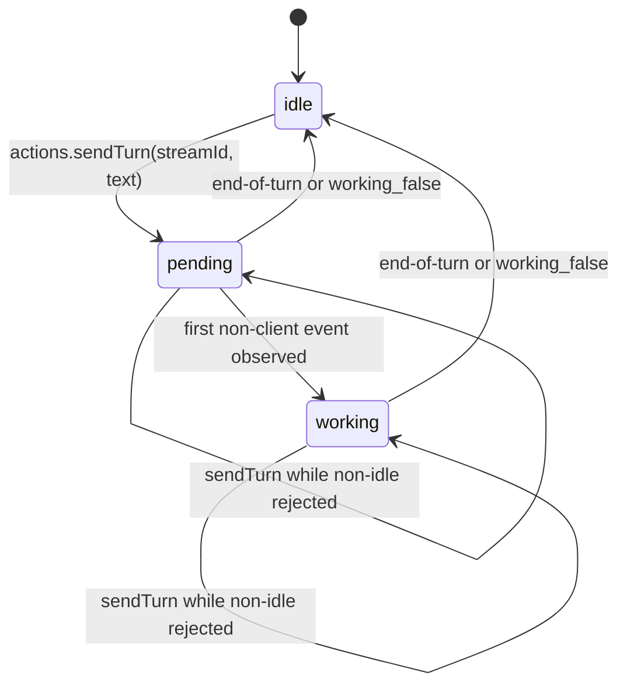

# Chat Screen Reconnect Contract

This contract describes the focused session screen while its structured stream
disconnects and reconnects. It is independent of any particular host or
deployment and uses `streamId` only as an application key.

## Reducer-owned turn state

Per-stream turn state lives in `state.workingByStream[streamId]`, with
`IDLE_TURN` as the screen fallback.

`actions.sendTurn(streamId, text)` is the only screen send entry point. It
appends an optimistic USER event, sets `phase: 'pending'`, stores an
`optimisticId` and `sentAt`, and returns the optimistic id. A send while the
phase is not `idle` returns `''`; concurrent turns are not queued by the
screen.

The first non-client event changes `pending` to `working` and records
`firstServerEventAt`. Normalized turn summaries and `WORKING` events with
`raw.working === false` close the turn. The screen derives dock visibility from
`phase === 'pending' || phase === 'working'`, disables Send from
`phase !== 'idle'`, and keeps no parallel optimistic flag or timeout.

## Staying on screen during reconnect

A disconnect/reconnect cycle must not navigate away from a focused session. A
redirect timer may arm only when all of these are true:

`isFocused && isReady && hasToken && !hasSession && hasHydrated && !connecting`

The eligibility predicate belongs in `src/services/sessionScreenRedirect.ts`.
Debounce the missing-session state for 1500 ms and cancel the timer whenever
connection, focus, hydration, or session availability changes. Keep the delay
below a few seconds so an actually deleted session does not look stuck.

## Turn state through reconnect

Reconnect does not reset an in-flight turn. Snapshot replacement preserves
`workingByStream[streamId]` for surviving streams. Optimistic reconciliation
remains the single place that marks a row failed. When a stream disappears,
remove both its working state and its selector cache version; do not let a
reused stream id inherit stale state.

`eventContentVersionByStream[streamId]` is retained for surviving streams and
bumps when replacement content changes. `selectSessionDetail` uses the version
in its cache key so an event received during reconnect renders without leaving
and reopening the screen.

## Mounted history refetch

Fetch recent history with `request_stream_events` only while focused and
connected. Track fetched and in-flight stream ids for the current connection
window, retry failures after 1000 ms, and clear those sets on disconnect. Fold
an `ok` response as one historical batch with `applyFetchedStreamEvents`, not
as a live-event loop. Emit `chat:history_backfill_rendered` only after a real
content row is present.

## Bounded auto-scroll

`planScroll` in `src/services/sessionScreenScroll.ts` returns:

- `none` while dragging, away from the sticky bottom, or when the transcript
  has not grown;
- `cold-start` for the first ingestion at the bottom, using one animation frame
  and one 120 ms layout chaser;
- `growth` for later transcript growth at the bottom, using one animation frame.

Reset the previous length when `streamId` changes and assign it exactly once
per planning pass. Composer focus may issue one explicit animation-frame scroll.

## Composer policy

The composer remains editable during an in-flight turn so the user may draft a
next message. Only the Send action is disabled while the turn phase is not
`idle`; the screen does not implement a local queue.

## Invariants

- A focused session survives transient missing inventory during reconnect.
- A surviving stream keeps its turn phase and content-version invalidation.
- A removed stream cannot leak state into a later stream with the same id.
- History backfill is rendered only from the new connection window.
- Auto-scroll is bounded and respects the user's drag position.
