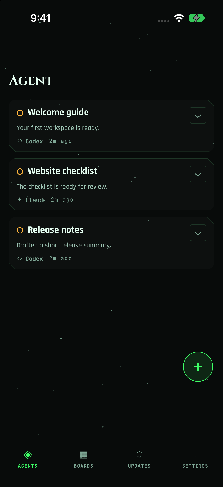
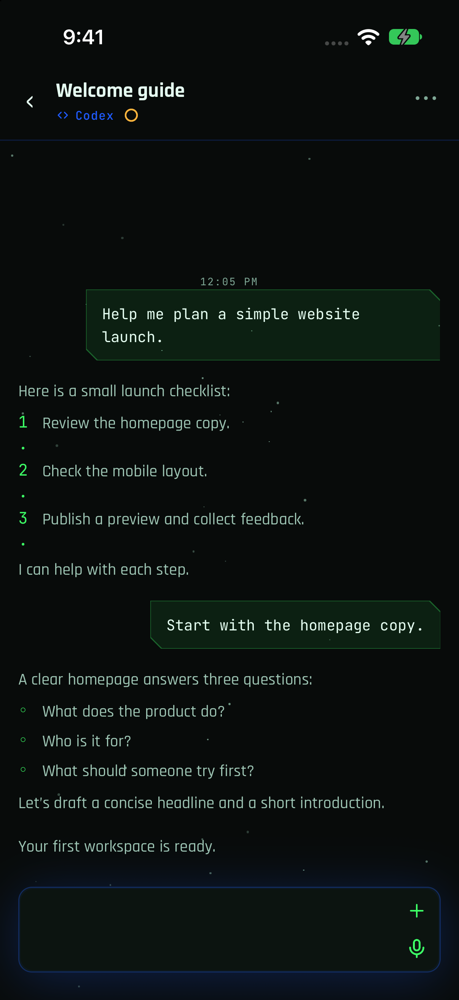
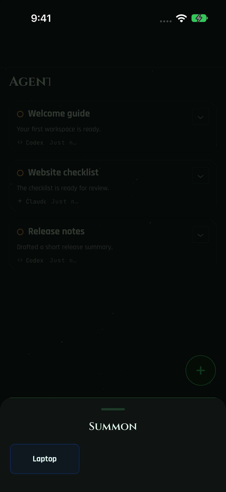

# Pentacle Mobile screenshots

A single-machine example with invented sessions and conversation text. Machine
icons hide automatically when the workspace has one host.

## Agents

Open a session from the agent list, or use + to start another one.

## Conversation

Read the session transcript and continue from the composer.

## New Chat

The Summon sheet lets you select the machine for a new agent session.

## Capture notes

Captured on 2026-10-02 from app source
`e948d0a68bb1e77a0e55950c0f40346436926c5d` on an iPhone 17 simulator
running iOS 27.0. These are native iOS captures, not React Native Web renders.

The `onboarding-single-host-v1` profile reuses the offline seed seam documented
in [SCREENSHOT_HARNESS.md](SCREENSHOT_HARNESS.md): one synthetic machine labelled
Laptop, three invented tasks (Welcome guide, Website checklist, Release notes)
and a website-planning conversation. The snapshot passes through production
reducers and real Expo Router screens. A local capture entry installs the
offline harness before seeding; local Expo configuration has exactly one host.
No live backend is connected. Capture-only authentication and biometric-lock
flags are enabled for this disposable simulator profile.

The current JavaScript bundle runs in a reused native simulator shell. This
proves the pictured native screen rendering; it does not certify a new native
release or physical-device capabilities. Navigation uses native taps and
captures use `xcrun simctl io <device> screenshot` after transitions settle.
No Simulator.app window is required for these three screens.

The implementation capture pass inspected every image for personal names,
phone numbers, real machine names, emails, credentials and file paths.
